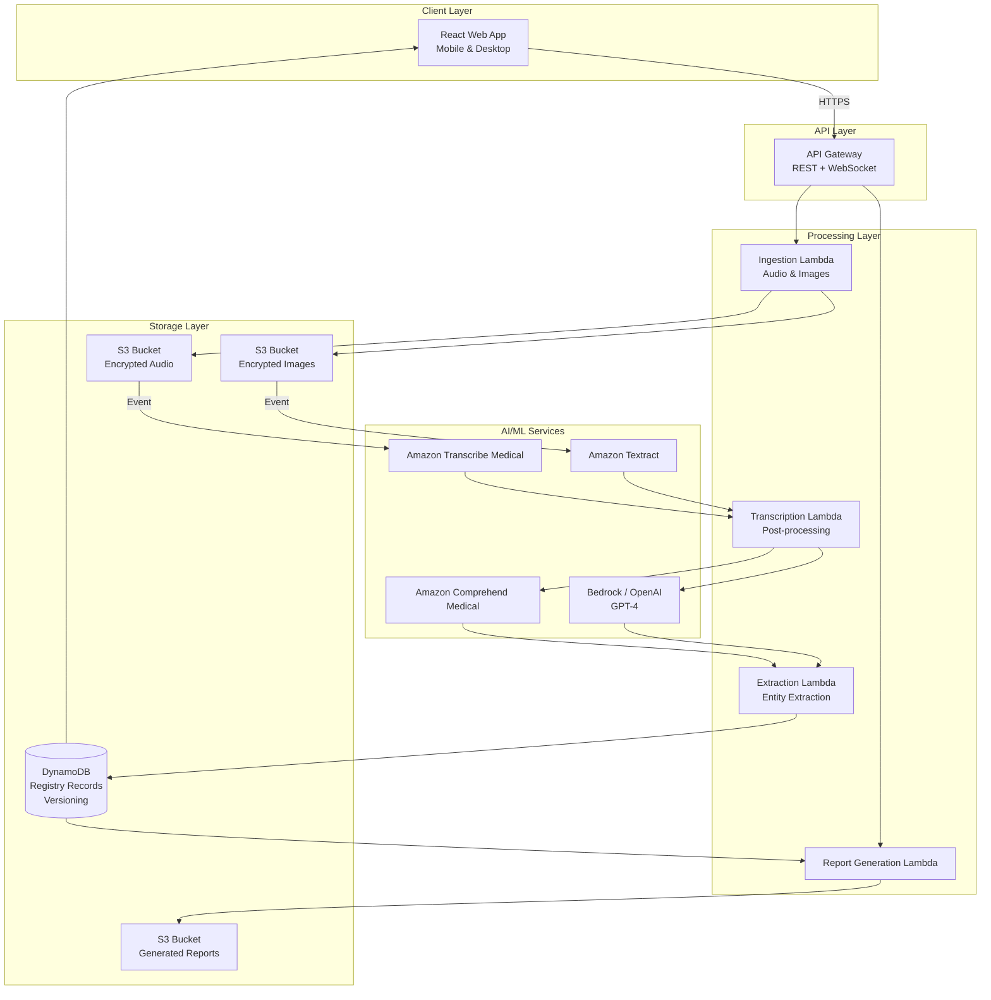

# Design Document: Clinical Registry System

## Overview

The Hybrid Voice-to-Structured-Data Clinical Registry System is a cloud-based application that enables clinicians to capture clinical data through voice recording or document scanning, automatically extract structured registry fields using AI/ML services, and review/confirm results through a streamlined single-screen interface. The system is built on AWS serverless architecture using TypeScript and React, with a focus on security, compliance, and rapid data entry.

### Key Design Principles

1. **Voice-First and Scan-First**: Minimize manual typing by prioritizing voice capture and document scanning
2. **Single-Screen Review**: All confirmation happens on one screen, optimized for <30 second completion
3. **Immutable Audit Trail**: All changes are versioned and tracked with complete provenance
4. **Mobile-First**: Responsive design supporting theatre, ward, and office contexts
5. **Security by Default**: Encryption at rest and in transit, IAM-based access control
6. **Graceful Degradation**: Offline support with local persistence and sync

## Architecture

### High-Level Architecture



### Technology Stack

**Frontend:**
- React 18+ with TypeScript
- Tailwind CSS for styling
- Lucide React for icons
- React hooks for state management
- MediaRecorder API for audio capture
- File API for image capture

**Backend:**
- AWS Lambda (Node.js 20.x runtime with TypeScript)
- API Gateway (REST + WebSocket for real-time updates)
- Amazon Transcribe Medical (speech-to-text)
- Amazon Textract (OCR)
- Amazon Comprehend Medical (entity extraction)
- AWS Bedrock or OpenAI GPT-4 (structured extraction)
- DynamoDB (NoSQL database with versioning)
- S3 (encrypted object storage)
- AWS IAM (authentication and authorization)
- AWS KMS (encryption key management)

**Infrastructure:**
- AWS CDK or Terraform for infrastructure as code
- CloudWatch for logging and monitoring
- X-Ray for distributed tracing

## Components and Interfaces

### 1. Voice Recording Component

**Purpose**: Capture audio from clinician narration using browser MediaRecorder API.

**Interface:**
```typescript
interface VoiceRecordingComponent {
  startRecording(): Promise<void>;
  pauseRecording(): void;
  resumeRecording(): void;
  stopRecording(): Promise<AudioBlob>;
  getRecordingState(): RecordingState;
}

interface AudioBlob {
  blob: Blob;
  duration: number;
  mimeType: string;
}

enum RecordingState {
  IDLE = 'idle',
  RECORDING = 'recording',
  PAUSED = 'paused',
  STOPPED = 'stopped'
}
```

**Key Behaviors:**
- Uses MediaRecorder API with audio/webm or audio/mp4 codec
- Supports pause/resume by maintaining recording chunks
- Emits real-time duration updates
- Handles browser permission requests
- Validates microphone availability

### 2. Document Scanning Component

**Purpose**: Capture images from mobile camera or desktop scanner/webcam.

**Interface:**
```typescript
interface DocumentScanningComponent {
  captureImage(): Promise<ImageCapture>;
  captureMultiplePages(): Promise<ImageCapture[]>;
  preprocessImage(image: ImageCapture): Promise<PreprocessedImage>;
  getSupportedFormats(): string[];
}

interface ImageCapture {
  blob: Blob;
  format: 'jpeg' | 'png' | 'pdf';
  timestamp: Date;
  deviceInfo: DeviceInfo;
}

interface PreprocessedImage {
  blob: Blob;
  originalBlob: Blob;
  transformations: ImageTransformation[];
}

interface ImageTransformation {
  type: 'rotation' | 'contrast' | 'noise_reduction';
  parameters: Record<string, any>;
}

interface DeviceInfo {
  deviceType: 'mobile' | 'desktop';
  platform: string;
  browser: string;
}
```

**Key Behaviors:**
- Uses File API and HTML5 input[type="file"] with capture attribute
- Supports camera access on mobile devices
- Supports file upload on desktop
- Performs client-side image preprocessing using Canvas API
- Supports multi-page sequential capture with preview
- Validates image format and size

### 3. Ingestion Lambda

**Purpose**: Receive audio/image uploads, validate, encrypt, and store in S3.

**Interface:**
```typescript
interface IngestionLambdaHandler {
  handleAudioUpload(event: APIGatewayEvent): Promise<IngestionResponse>;
  handleImageUpload(event: APIGatewayEvent): Promise<IngestionResponse>;
}

interface IngestionRequest {
  patientId: string;
  encounterId: string;
  userId: string;
  contentType: 'audio' | 'image';
  data: string; // base64 encoded
  metadata: IngestionMetadata;
}

interface IngestionMetadata {
  timestamp: string;
  deviceInfo: DeviceInfo;
  context: 'theatre' | 'ward' | 'office';
}

interface IngestionResponse {
  success: boolean;
  recordId: string;
  s3Key: string;
  uploadTimestamp: string;
}
```

**Key Behaviors:**
- Validates request payload and authentication
- Generates unique record ID
- Uploads to S3 with server-side encryption (SSE-KMS)
- Creates DynamoDB record with metadata
- Triggers downstream processing (Transcribe/Textract)
- Returns signed URL for status polling

### 4. Transcription Service Integration

**Purpose**: Convert audio to medical-grade text using Amazon Transcribe Medical.

**Interface:**
```typescript
interface TranscriptionService {
  startTranscription(audioS3Key: string): Promise<TranscriptionJob>;
  getTranscriptionStatus(jobId: string): Promise<TranscriptionStatus>;
  getTranscriptionResult(jobId: string): Promise<TranscriptionResult>;
}

interface TranscriptionJob {
  jobId: string;
  status: 'IN_PROGRESS' | 'COMPLETED' | 'FAILED';
  startTime: string;
}

interface TranscriptionResult {
  transcript: string;
  utterances: Utterance[];
  confidence: number;
  medicalTerms: MedicalTerm[];
}

interface Utterance {
  text: string;
  startTime: number;
  endTime: number;
  confidence: number;
}

interface MedicalTerm {
  text: string;
  category: string;
  confidence: number;
}
```

**Key Behaviors:**
- Configures Transcribe Medical with medical specialty (e.g., PRIMARYCARE, CARDIOLOGY)
- Supports near-real-time streaming for theatre context
- Supports batch processing for office context
- Preserves utterance timestamps
- Extracts medical terminology with confidence scores
- Stores transcription linked to original audio S3 key

### 5. OCR Service Integration

**Purpose**: Extract text from scanned images using Amazon Textract.

**Interface:**
```typescript
interface OCRService {
  startOCR(imageS3Key: string): Promise<OCRJob>;
  getOCRStatus(jobId: string): Promise<OCRStatus>;
  getOCRResult(jobId: string): Promise<OCRResult>;
}

interface OCRJob {
  jobId: string;
  status: 'IN_PROGRESS' | 'COMPLETED' | 'FAILED';
  startTime: string;
}

interface OCRResult {
  extractedText: string;
  blocks: TextBlock[];
  confidence: number;
  documentType: 'handwritten' | 'printed' | 'mixed';
}

interface TextBlock {
  text: string;
  blockType: 'LINE' | 'WORD';
  confidence: number;
  geometry: BoundingBox;
}

interface BoundingBox {
  top: number;
  left: number;
  width: number;
  height: number;
}
```

**Key Behaviors:**
- Uses Textract DetectDocumentText API for text extraction
- Detects handwritten vs printed text
- Assigns confidence scores per text block
- Preserves spatial layout information
- Handles multi-page documents
- Stores OCR result linked to original image S3 key

### 6. Structured Extraction Service

**Purpose**: Extract structured clinical entities from transcription or OCR text using Comprehend Medical and LLM.

**Interface:**
```typescript
interface StructuredExtractionService {
  extractEntities(text: string, source: 'voice' | 'scan'): Promise<ExtractionResult>;
  calculateConfidence(entity: ExtractedEntity, source: 'voice' | 'scan'): number;
}

interface ExtractionResult {
  entities: ExtractedEntity[];
  narratives: ClinicalNarrative[];
  structuredData: RegistryFields;
  extractionMetadata: ExtractionMetadata;
}

interface ExtractedEntity {
  type: EntityType;
  value: string;
  confidence: number;
  sourceText: string;
  sourceOffset: number;
}

enum EntityType {
  PROCEDURE = 'procedure',
  DIAGNOSIS = 'diagnosis',
  COMPLICATION = 'complication',
  ANATOMY = 'anatomy',
  DEVICE = 'device',
  MEDICATION = 'medication',
  VITAL_SIGN = 'vital_sign',
  LAB_VALUE = 'lab_value'
}

interface ClinicalNarrative {
  type: 'reasoning' | 'explanation' | 'observation';
  text: string;
  relatedEntities: string[];
}

interface RegistryFields {
  procedureCode?: string;
  procedureName?: string;
  diagnosis?: string[];
  complications?: string[];
  devices?: string[];
  medications?: string[];
  vitalSigns?: Record<string, number>;
  labValues?: Record<string, number>;
  narrativeNote?: string;
}

interface ExtractionMetadata {
  source: 'voice' | 'scan';
  sourceText: string;
  extractionMethod: 'comprehend' | 'llm' | 'hybrid';
  extractionTimestamp: string;
  modelVersion: string;
}
```

**Key Behaviors:**
- Uses Comprehend Medical DetectEntities API for initial entity extraction
- Uses LLM (GPT-4 or Bedrock) for structured field mapping
- Calculates confidence scores based on source quality and entity detection confidence
- Applies source-specific confidence adjustments (handwritten: 0.50-0.75, printed: 0.75-0.95)
- Ensures deterministic confidence scoring for identical inputs
- Generates structured JSON output matching registry schema
- Preserves traceability to source text


### 7. Pre-fill Service

**Purpose**: Retrieve and merge existing patient and procedure data from external systems.

**Interface:**
```typescript
interface PreFillService {
  getPatientData(patientId: string): Promise<PatientData>;
  getProcedureData(encounterId: string): Promise<ProcedureData>;
  mergeWithExtractedData(prefill: PreFillData, extracted: RegistryFields): Promise<MergedFields>;
}

interface PatientData {
  patientId: string;
  demographics: Demographics;
  medicalHistory: string[];
}

interface Demographics {
  name: string;
  dateOfBirth: string;
  gender: string;
  mrn: string;
}

interface ProcedureData {
  encounterId: string;
  procedureCode: string;
  scheduledDate: string;
  surgeon: string;
  facility: string;
}

interface PreFillData {
  patient: PatientData;
  procedure: ProcedureData;
}

interface MergedFields {
  fields: Record<string, FieldValue>;
  conflicts: FieldConflict[];
}

interface FieldValue {
  value: any;
  source: 'system' | 'voice' | 'scan' | 'manual';
  confidence?: number;
  isEdited: boolean;
}

interface FieldConflict {
  fieldName: string;
  systemValue: any;
  extractedValue: any;
  resolution: 'prefer_extracted' | 'prefer_system' | 'manual_review';
}
```

**Key Behaviors:**
- Queries external EHR/EMR systems via API
- Caches patient and procedure data
- Merges pre-filled data with extracted data
- Prioritizes extracted data over system data when conflicts occur
- Marks all fields with source provenance
- Flags conflicts for clinician review

### 8. Draft Record Manager

**Purpose**: Persist and manage draft registry records with versioning support.

**Interface:**
```typescript
interface DraftRecordManager {
  createDraft(data: DraftRecordData): Promise<DraftRecord>;
  updateDraft(recordId: string, updates: Partial<DraftRecordData>): Promise<DraftRecord>;
  getDraft(recordId: string): Promise<DraftRecord>;
  listDrafts(userId: string, filters?: DraftFilters): Promise<DraftRecord[]>;
  deleteDraft(recordId: string): Promise<void>;
}

interface DraftRecordData {
  patientId: string;
  encounterId: string;
  userId: string;
  fields: Record<string, FieldValue>;
  status: 'draft' | 'in_review' | 'submitted';
  metadata: DraftMetadata;
}

interface DraftRecord extends DraftRecordData {
  recordId: string;
  createdAt: string;
  updatedAt: string;
  version: number;
}

interface DraftMetadata {
  audioS3Key?: string;
  imageS3Keys?: string[];
  transcriptionJobId?: string;
  ocrJobIds?: string[];
  extractionJobId?: string;
  context: 'theatre' | 'ward' | 'office';
}

interface DraftFilters {
  status?: string;
  dateFrom?: string;
  dateTo?: string;
  patientId?: string;
}
```

**Key Behaviors:**
- Stores draft records in DynamoDB with TTL for cleanup
- Supports partial updates without overwriting entire record
- Persists across browser sessions
- Supports offline mode with local storage sync
- Maintains link to source audio/images
- Tracks processing status for async operations

### 9. Review Interface Component

**Purpose**: Single-screen UI for clinician review and confirmation of extracted data.

**Interface:**
```typescript
interface ReviewInterfaceComponent {
  loadDraft(recordId: string): Promise<void>;
  acceptField(fieldName: string): void;
  editField(fieldName: string, newValue: any): void;
  submitRecord(): Promise<SubmissionResult>;
  getFieldStatus(fieldName: string): FieldStatus;
}

interface FieldStatus {
  value: any;
  confidence: number;
  source: 'system' | 'voice' | 'scan' | 'manual';
  isRequired: boolean;
  isConfirmed: boolean;
  isEdited: boolean;
  visualIndicator: 'green' | 'yellow' | 'red';
}

interface SubmissionResult {
  success: boolean;
  recordId: string;
  version: string;
  submittedAt: string;
}
```

**Key Behaviors:**
- Displays all fields on single screen without pagination
- Applies color coding based on confidence thresholds:
  - Green (≥0.85): Auto-accepted
  - Yellow (0.60-0.84): Review suggested
  - Red (<0.60): Required review
- Highlights missing required fields
- Shows source indicator for each field
- Enables inline editing on tap
- Disables submit until all required fields confirmed
- Loads within 1 second
- Optimized for mobile touch targets (44px minimum)

### 10. Version Control Service

**Purpose**: Manage immutable version history and audit trails for registry records.

**Interface:**
```typescript
interface VersionControlService {
  createVersion(recordId: string, data: VersionData): Promise<VersionRecord>;
  getVersion(recordId: string, versionNumber: string): Promise<VersionRecord>;
  listVersions(recordId: string): Promise<VersionRecord[]>;
  compareVersions(recordId: string, v1: string, v2: string): Promise<VersionDiff>;
  getCurrentVersion(recordId: string): Promise<VersionRecord>;
}

interface VersionData {
  fields: Record<string, any>;
  changeReason: string;
  changeType: 'create' | 'update' | 'correction';
  userId: string;
  metadata: VersionMetadata;
}

interface VersionRecord {
  recordId: string;
  versionNumber: string;
  fields: Record<string, any>;
  changeReason: string;
  changeType: string;
  userId: string;
  timestamp: string;
  isCurrent: boolean;
  previousVersion?: string;
  metadata: VersionMetadata;
  auditTrail: AuditEntry[];
}

interface VersionMetadata {
  ipAddress: string;
  deviceInfo: DeviceInfo;
  conflictResolution?: string;
}

interface AuditEntry {
  action: 'create' | 'read' | 'update' | 'delete';
  userId: string;
  timestamp: string;
  fieldChanges?: FieldChange[];
  ipAddress: string;
  deviceInfo: DeviceInfo;
}

interface FieldChange {
  fieldName: string;
  oldValue: any;
  newValue: any;
  source: string;
}

interface VersionDiff {
  recordId: string;
  version1: string;
  version2: string;
  changes: FieldChange[];
  summary: string;
}
```

**Key Behaviors:**
- Creates immutable version records in DynamoDB
- Uses composite key (recordId + versionNumber) for versioning
- Maintains current version pointer via GSI
- Enforces immutability at database level using conditional writes
- Captures complete audit trail for all operations
- Supports version comparison and diff generation
- Preserves complete field history
- Never deletes historical versions

### 11. Report Generation Service

**Purpose**: Generate clinical reports from registry data with filtering and formatting options.

**Interface:**
```typescript
interface ReportGenerationService {
  generateReport(request: ReportRequest): Promise<ReportResult>;
  getReportStatus(jobId: string): Promise<ReportStatus>;
  downloadReport(reportId: string): Promise<ReportDownload>;
  scheduleReport(schedule: ReportSchedule): Promise<ScheduledReport>;
}

interface ReportRequest {
  reportType: ReportType;
  filters: ReportFilters;
  outputFormat: 'pdf' | 'excel' | 'csv' | 'json';
  includeCharts: boolean;
  deidentify: boolean;
}

enum ReportType {
  PATIENT_PROCEDURE = 'patient_procedure',
  SURGEON_PERFORMANCE = 'surgeon_performance',
  COMPLICATION_ANALYSIS = 'complication_analysis',
  PROCEDURE_VOLUME = 'procedure_volume',
  QUALITY_METRICS = 'quality_metrics',
  AUDIT_COMPLIANCE = 'audit_compliance',
  REGISTRY_EXPORT = 'registry_export'
}

interface ReportFilters {
  dateFrom?: string;
  dateTo?: string;
  surgeonIds?: string[];
  procedureTypes?: string[];
  complicationTypes?: string[];
  patientDemographics?: Record<string, any>;
  facilities?: string[];
}

interface ReportResult {
  success: boolean;
  reportId: string;
  jobId?: string;
  status: 'completed' | 'in_progress' | 'failed';
  downloadUrl?: string;
  generatedAt?: string;
}

interface ReportStatus {
  jobId: string;
  status: 'queued' | 'processing' | 'completed' | 'failed';
  progress: number;
  estimatedCompletion?: string;
}

interface ReportDownload {
  reportId: string;
  signedUrl: string;
  expiresAt: string;
  format: string;
  sizeBytes: number;
}

interface ReportSchedule {
  reportType: ReportType;
  filters: ReportFilters;
  frequency: 'daily' | 'weekly' | 'monthly';
  recipients: string[];
  outputFormat: string;
}

interface ScheduledReport {
  scheduleId: string;
  nextRun: string;
  enabled: boolean;
}
```

**Key Behaviors:**
- Queries DynamoDB with filters and pagination
- Aggregates data for summary reports
- Generates visualizations using charting library
- Formats output based on requested format
- Applies de-identification for research reports
- Enforces role-based access control
- Supports synchronous generation for small reports (<10s)
- Supports asynchronous generation for large reports with polling
- Stores generated reports in S3 with signed URLs
- Supports scheduled report generation via EventBridge

## Data Models

### DynamoDB Table Design

**Primary Table: RegistryRecords**

Partition Key: `recordId` (String)
Sort Key: `versionNumber` (String)

**Attributes:**
```typescript
interface RegistryRecordItem {
  recordId: string;              // PK
  versionNumber: string;         // SK (e.g., "1.0", "1.1", "2.0")
  patientId: string;             // GSI1-PK
  encounterId: string;
  userId: string;                // GSI2-PK
  status: 'draft' | 'submitted' | 'superseded';
  fields: Record<string, FieldValue>;
  changeReason?: string;
  changeType?: 'create' | 'update' | 'correction';
  isCurrent: boolean;            // GSI3-PK
  createdAt: string;             // ISO timestamp
  updatedAt: string;
  submittedAt?: string;
  metadata: RecordMetadata;
  auditTrail: AuditEntry[];
  ttl?: number;                  // For draft cleanup
}

interface RecordMetadata {
  audioS3Key?: string;
  imageS3Keys?: string[];
  transcriptionJobId?: string;
  ocrJobIds?: string[];
  extractionJobId?: string;
  context: 'theatre' | 'ward' | 'office';
  ipAddress: string;
  deviceInfo: DeviceInfo;
}
```

**Global Secondary Indexes:**
- GSI1: `patientId` (PK) + `createdAt` (SK) - Query records by patient
- GSI2: `userId` (PK) + `createdAt` (SK) - Query records by clinician
- GSI3: `isCurrent` (PK) + `updatedAt` (SK) - Query current versions only

**Access Patterns:**
1. Get current version of record: Query by recordId + isCurrent=true
2. Get all versions of record: Query by recordId
3. Get patient's records: Query GSI1 by patientId
4. Get clinician's drafts: Query GSI2 by userId + status=draft
5. List recent submissions: Query GSI3 by isCurrent=true

### S3 Bucket Structure

**Audio Bucket: `clinical-registry-audio-{env}`**
```
/{patientId}/{encounterId}/{recordId}/audio.webm
```

**Images Bucket: `clinical-registry-images-{env}`**
```
/{patientId}/{encounterId}/{recordId}/page-{n}.jpg
```

**Reports Bucket: `clinical-registry-reports-{env}`**
```
/{reportType}/{year}/{month}/{reportId}.{format}
```

**Encryption:**
- All buckets use SSE-KMS with customer-managed keys
- Bucket policies enforce encryption in transit (TLS)
- Versioning enabled for audit compliance

### Field Value Schema

```typescript
interface FieldValue {
  value: any;
  confidence: number;           // 0.0 - 1.0
  source: 'system' | 'voice' | 'scan' | 'manual';
  isEdited: boolean;
  isConfirmed: boolean;
  extractionMetadata?: {
    sourceText: string;
    extractionMethod: string;
    extractionTimestamp: string;
  };
}
```

### Registry Field Definitions

```typescript
interface RegistryFields {
  // Patient Information (pre-filled)
  patientId: string;
  patientName: string;
  dateOfBirth: string;
  gender: string;
  mrn: string;
  
  // Procedure Information (pre-filled + extracted)
  procedureCode: string;
  procedureName: string;
  procedureDate: string;
  surgeonId: string;
  surgeonName: string;
  facility: string;
  
  // Clinical Data (extracted)
  primaryDiagnosis: string;
  secondaryDiagnoses: string[];
  complications: Complication[];
  devices: Device[];
  medications: Medication[];
  vitalSigns: VitalSigns;
  labValues: LabValues;
  
  // Narrative (extracted)
  clinicalReasoning: string;
  procedureNotes: string;
  postOpNotes: string;
  
  // Metadata
  dataCompleteness: number;      // 0-100%
  overallConfidence: number;     // 0.0-1.0
}

interface Complication {
  type: string;
  severity: 'minor' | 'moderate' | 'major';
  description: string;
  onset: string;
}

interface Device {
  name: string;
  manufacturer: string;
  serialNumber?: string;
  implanted: boolean;
}

interface Medication {
  name: string;
  dose: string;
  route: string;
  frequency: string;
}

interface VitalSigns {
  bloodPressure?: string;
  heartRate?: number;
  temperature?: number;
  oxygenSaturation?: number;
}

interface LabValues {
  hemoglobin?: number;
  whiteBloodCount?: number;
  platelets?: number;
  creatinine?: number;
  [key: string]: number | undefined;
}
```


## Correctness Properties

*A property is a characteristic or behavior that should hold true across all valid executions of a system—essentially, a formal statement about what the system should do. Properties serve as the bridge between human-readable specifications and machine-verifiable correctness guarantees.*

### Voice Recording Properties

**Property 1: Recording initiation across platforms**
*For any* supported platform (mobile iOS/Android or desktop browser), initiating voice recording should successfully begin audio capture.
**Validates: Requirements 1.1**

**Property 2: Pause-resume preserves recording**
*For any* active recording, pausing then resuming should preserve all previously captured audio and append new audio to create a complete recording.
**Validates: Requirements 1.2, 1.3**

**Property 3: Recording metadata completeness**
*For any* completed audio recording, the stored recording should be associated with patient identifier, encounter identifier, user identifier, and timestamp.
**Validates: Requirements 1.4**

**Property 4: Audio encryption at rest**
*For any* stored audio recording, the file should be encrypted at rest with verifiable encryption metadata.
**Validates: Requirements 1.5**

**Property 5: Recording persistence performance**
*For any* stopped recording, the audio file should be persisted within 5 seconds.
**Validates: Requirements 1.6**

### Document Scanning Properties

**Property 6: Image format acceptance**
*For any* document image in JPEG, PNG, or PDF format, the system should accept and process the image.
**Validates: Requirements 2.3**

**Property 7: Image preprocessing application**
*For any* captured document image, the system should apply automatic rotation, contrast enhancement, and noise reduction before OCR.
**Validates: Requirements 2.4**

**Property 8: OCR execution**
*For any* preprocessed image, the system should perform OCR to extract text content.
**Validates: Requirements 2.5**

**Property 9: OCR traceability**
*For any* OCR result, the extracted text should be linked to the original scanned image.
**Validates: Requirements 2.6**

**Property 10: Image encryption at rest**
*For any* stored scanned document, the image file should be encrypted at rest with verifiable encryption metadata.
**Validates: Requirements 2.7**

**Property 11: Document metadata completeness**
*For any* stored scanned document, the document should be associated with patient identifier, encounter identifier, user identifier, and timestamp.
**Validates: Requirements 2.8**

**Property 12: Multi-page document grouping**
*For any* sequence of scanned pages, the system should combine them into a single document set with preserved page order.
**Validates: Requirements 2.9**

**Property 13: OCR confidence scoring by text type**
*For any* OCR result, if the text is handwritten, confidence scores should fall between 0.50 and 0.75; if printed, confidence scores should fall between 0.75 and 0.95.
**Validates: Requirements 2.10, 2.11**

### Transcription Properties

**Property 14: Transcription initiation**
*For any* completed audio recording, the system should initiate medical-grade speech-to-text transcription.
**Validates: Requirements 3.1**

**Property 15: Near-real-time transcription performance**
*For any* audio recording in theatre or ward context, transcription processing should occur in near-real-time.
**Validates: Requirements 3.2**

**Property 16: Utterance timestamp preservation**
*For any* transcription result, each utterance should have an associated timestamp.
**Validates: Requirements 3.4**

**Property 17: Transcription traceability**
*For any* transcription result, the output should be linked to the original audio recording.
**Validates: Requirements 3.5**

**Property 18: Transcription error handling**
*For any* transcription failure, the system should log the error and notify the clinician.
**Validates: Requirements 3.6**

### Structured Extraction Properties

**Property 19: Entity extraction from text sources**
*For any* transcription text or OCR text, the system should extract structured clinical entities including procedures, diagnoses, complications, anatomy, devices, medications, vital signs, and lab values.
**Validates: Requirements 4.1, 4.2**

**Property 20: Narrative extraction**
*For any* extraction result, the system should extract narrative explanations and clinical reasoning.
**Validates: Requirements 4.3**

**Property 21: Structured JSON output generation**
*For any* completed extraction, the system should generate valid structured JSON output containing all extracted fields.
**Validates: Requirements 4.4**

**Property 22: Confidence score validity**
*For any* extracted field, the assigned confidence score should be between 0.0 and 1.0 inclusive.
**Validates: Requirements 4.5**

**Property 23: Extraction metadata completeness**
*For any* extraction result, the metadata should include originating source (voice/scan), source text, extraction method, and extraction timestamp.
**Validates: Requirements 4.6**

**Property 24: Confidence scoring determinism**
*For any* input text, performing extraction twice should produce identical confidence scores for all extracted fields.
**Validates: Requirements 4.7**

**Property 25: Voice transcription confidence calculation**
*For any* extraction from voice transcription, the confidence scores should be based on transcription quality metrics.
**Validates: Requirements 4.8**

**Property 26: Extraction confidence ranges by source**
*For any* extraction from scanned printed text, base confidence should be between 0.75 and 0.95; for scanned handwritten text, base confidence should be between 0.50 and 0.75.
**Validates: Requirements 4.9, 4.10**

### Pre-fill and De-duplication Properties

**Property 27: Patient demographics pre-fill**
*For any* new registry record, patient demographics should be automatically pre-filled from existing systems.
**Validates: Requirements 5.1**

**Property 28: Procedure data pre-fill**
*For any* new registry record, procedure codes, surgeon name, date, and time should be automatically pre-filled from existing systems.
**Validates: Requirements 5.2**

**Property 29: Source indicator display**
*For any* displayed field, the system should show a source indicator distinguishing system-derived, voice-extracted, scan-extracted, and manually edited fields.
**Validates: Requirements 5.3**

**Property 30: Edit tracking and preservation**
*For any* clinician edit to a pre-filled field, the system should mark the field as manually edited and preserve the edit.
**Validates: Requirements 5.4**

**Property 31: Conflict resolution**
*For any* conflict between pre-filled data and extracted data, the system should prioritize extracted data and flag the conflict for review.
**Validates: Requirements 5.5**

### Draft Record Properties

**Property 32: Draft creation from extraction**
*For any* completed structured data extraction, the system should create a draft registry record containing all extracted field values.
**Validates: Requirements 6.1**

**Property 33: Draft confidence score storage**
*For any* draft record, confidence scores should be stored for each extracted field.
**Validates: Requirements 6.2**

**Property 34: Draft provenance storage**
*For any* draft record, provenance metadata indicating source (voice/scan/manual) should be stored for each field.
**Validates: Requirements 6.3**

**Property 35: Draft persistence across sessions**
*For any* draft record, the draft should persist when a clinician abandons a session or closes the browser.
**Validates: Requirements 6.4, 6.5**

**Property 36: Draft retrieval and continuation**
*For any* persisted draft record, a returning clinician should be able to retrieve and continue the incomplete draft.
**Validates: Requirements 6.6**

**Property 37: Offline draft preservation and sync**
*For any* draft being created, if network connectivity is lost, the system should preserve draft data locally and sync when connectivity is restored.
**Validates: Requirements 6.7**

### Review Interface Properties

**Property 38: Low-confidence field highlighting**
*For any* field with confidence score below 0.85, the system should highlight the field in the review interface.
**Validates: Requirements 7.2**

**Property 39: Missing required field highlighting**
*For any* required field without a value, the system should highlight the field in the review interface.
**Validates: Requirements 7.3**

**Property 40: Field source indicator display**
*For any* displayed field, the system should show a source indicator (voice/scan/manual/system).
**Validates: Requirements 7.4**

**Property 41: Confidence-based color coding**
*For any* field, the visual indicator should be green if confidence ≥ 0.85, yellow if confidence is between 0.60 and 0.84, and red if confidence < 0.60.
**Validates: Requirements 7.5, 7.6, 7.7**

**Property 42: Field acceptance interaction**
*For any* field, when a clinician taps the checkmark, the system should mark the field as accepted.
**Validates: Requirements 7.8**

**Property 43: Inline editing interaction**
*For any* field, when a clinician taps the field value, the system should enable inline editing.
**Validates: Requirements 7.9**

**Property 44: Manual edit marking**
*For any* field that a clinician edits, the system should mark the field as manually edited.
**Validates: Requirements 7.10**

**Property 45: Submit button state management**
*For any* review interface state, the submit button should be enabled if and only if all required fields are confirmed.
**Validates: Requirements 7.11, 7.12**

**Property 46: Review interface load performance**
*For any* review interface load, the display should appear within 1 second.
**Validates: Requirements 7.13**

### Version Control Properties

**Property 47: Version creation on update**
*For any* update to a submitted registry record, the system should create a new version record.
**Validates: Requirements 8.1**

**Property 48: Version immutability and preservation**
*For any* version record, the record should be immutable and all previous versions should be preserved indefinitely without deletion or overwrite.
**Validates: Requirements 8.2, 8.3, 8.11**

**Property 49: Version metadata completeness**
*For any* version record, the record should include version number, full field snapshot, timestamp, user identifier, change reason, change type, current version flag, version lineage, and conflict resolution method.
**Validates: Requirements 8.4, 8.5**

**Property 50: Audit trail completeness**
*For any* data change, the system should record original extracted values, all intermediate edits, final submitted values, user identity, timestamps, IP address, device info, and source of change.
**Validates: Requirements 8.6**

**Property 51: Version history retrieval**
*For any* registry record, the system should support retrieval of complete version history.
**Validates: Requirements 8.7**

**Property 52: Version comparison support**
*For any* two versions of a registry record, the system should support version comparison.
**Validates: Requirements 8.8**

**Property 53: Audit trail filtering**
*For any* audit trail query, the system should support filtering changes by user, date, field, or change type.
**Validates: Requirements 8.9**

**Property 54: Audit trail export**
*For any* audit trail, the system should support exporting audit trail data.
**Validates: Requirements 8.10**

**Property 55: Current version flag update**
*For any* change in current version, the system should only update the current version flag without modifying version content.
**Validates: Requirements 8.13**

### Submission Properties

**Property 56: Initial version creation**
*For any* first submission of a confirmed draft record, the system should persist the record as version 1.0.
**Validates: Requirements 9.1**

**Property 57: Submission status update**
*For any* record submission, the system should mark the record status as "submitted".
**Validates: Requirements 9.2**

**Property 58: Record locking**
*For any* submitted record, the system should lock the record from casual editing.
**Validates: Requirements 9.3**

**Property 59: Version increment on edit**
*For any* edit to a submitted record, the system should create a new version with correctly incremented version number (1.1, 1.2, etc.).
**Validates: Requirements 9.4**

**Property 60: Version supersession**
*For any* new version creation, the system should mark the previous version as superseded.
**Validates: Requirements 9.5**

**Property 61: Current version pointer update**
*For any* new version creation, the system should update the current version flag to point to the new version.
**Validates: Requirements 9.6**

**Property 62: Audit trail continuity**
*For any* new version creation, the system should maintain the complete audit trail linking all versions.
**Validates: Requirements 9.7**

### Report Generation Properties

**Property 63: Report type generation**
*For any* report request of a specific type (patient procedure, surgeon performance, complication analysis, procedure volume, quality metrics, audit compliance, or registry export), the system should generate a report with appropriate content for that type.
**Validates: Requirements 10.1, 10.2, 10.3, 10.4, 10.5, 10.6, 10.7**

**Property 64: Report date range filtering**
*For any* report with customizable date range, the system should filter data according to the specified date range.
**Validates: Requirements 10.8**

**Property 65: Report multi-dimensional filtering**
*For any* report with filters, the system should support filtering by surgeon, procedure type, complication type, patient demographics, and facility location.
**Validates: Requirements 10.9**

**Property 66: Report output format support**
*For any* report request, the system should support generating output in PDF, Excel, CSV, and JSON formats.
**Validates: Requirements 10.10**

**Property 67: Report metadata inclusion**
*For any* report, when applicable, the system should include version history, confidence scores, manually edited field indicators, and audit trail summaries.
**Validates: Requirements 10.11, 10.12, 10.13, 10.14**

**Property 68: Report visualization support**
*For any* report, the system should support charts and visualizations including trend charts, comparison graphs, and distribution histograms.
**Validates: Requirements 10.15**

**Property 69: Report access control**
*For any* report request, the system should enforce role-based access controls.
**Validates: Requirements 10.16**

**Property 70: Patient privacy protection**
*For any* report containing patient data, the system should apply patient privacy protections.
**Validates: Requirements 10.17**

**Property 71: Research report de-identification**
*For any* research report, the system should support de-identification options.
**Validates: Requirements 10.18**

**Property 72: Scheduled report automation**
*For any* scheduled report, the system should support automatic generation and email delivery.
**Validates: Requirements 10.19**

**Property 73: Individual report generation performance**
*For any* individual patient report, generation should complete within 10 seconds.
**Validates: Requirements 10.20**

**Property 74: Aggregate report generation performance**
*For any* aggregate report with up to 1000 records, generation should complete within 60 seconds.
**Validates: Requirements 10.21**

**Property 75: Asynchronous large report generation**
*For any* report with large datasets, the system should support asynchronous generation with notification upon completion.
**Validates: Requirements 10.22**

### Performance and Reliability Properties

**Property 76: End-to-end processing performance**
*For any* end-to-end processing from recording/scanning to draft record, the system should complete within 2 minutes.
**Validates: Requirements 12.1**

**Property 77: Review interface load performance**
*For any* review interface load, the system should display within 1 second.
**Validates: Requirements 12.2**

**Property 78: OCR processing performance**
*For any* document OCR processing, the system should complete within 30 seconds per document.
**Validates: Requirements 12.3**

**Property 79: Individual report performance**
*For any* individual patient report generation, the system should complete within 10 seconds.
**Validates: Requirements 12.4**

**Property 80: Aggregate report performance**
*For any* aggregate report with up to 1000 records, generation should complete within 60 seconds.
**Validates: Requirements 12.5**

**Property 81: Draft persistence without data loss**
*For any* draft record, the draft should persist across sessions without any data loss.
**Validates: Requirements 12.6**

**Property 82: Offline resilience and sync**
*For any* draft creation during network failure, the system should preserve data locally and sync when connectivity is restored without data loss.
**Validates: Requirements 12.7**

**Property 83: Client error resilience**
*For any* client-side error, the system should preserve all captured data without loss.
**Validates: Requirements 12.8**

**Property 84: Concurrent processing performance**
*For any* concurrent voice recording and document scanning, the system should process both inputs without performance degradation.
**Validates: Requirements 12.9**

**Property 85: Multi-page scanning efficiency**
*For any* multi-page document scan, the system should handle sequential page capture efficiently.
**Validates: Requirements 12.10**

### Accessibility Properties

**Property 86: Accessible component implementation**
*For any* user interface component, the system should provide ARIA labels and keyboard navigation support.
**Validates: Requirements 13.7**

**Property 87: Touch target sizing**
*For any* touch interface element, the element should have a minimum tap target size of 44px.
**Validates: Requirements 13.10**


## Error Handling

### Error Categories

**1. User Input Errors**
- Invalid file formats
- Corrupted audio/image files
- Missing required fields
- Invalid field values

**Handling Strategy:**
- Validate inputs at the client before upload
- Display clear, actionable error messages
- Preserve user data and allow correction
- Log validation failures for monitoring

**2. Processing Errors**
- Transcription service failures
- OCR service failures
- Entity extraction failures
- LLM API failures

**Handling Strategy:**
- Implement exponential backoff retry logic (3 attempts)
- Fall back to alternative processing methods when available
- Preserve source data (audio/images) for manual review
- Notify clinician of processing failures with option to retry
- Log all processing errors with context for debugging

**3. Network Errors**
- Upload failures
- API timeouts
- Connection interruptions

**Handling Strategy:**
- Implement client-side retry with exponential backoff
- Use local storage for offline draft persistence
- Queue operations for sync when connectivity restored
- Display connection status to user
- Preserve all captured data locally

**4. Storage Errors**
- S3 upload failures
- DynamoDB write failures
- Encryption key unavailability

**Handling Strategy:**
- Retry with exponential backoff
- Use dead letter queues for failed operations
- Alert operations team for persistent failures
- Maintain data integrity through transactions
- Log all storage errors with full context

**5. Version Conflict Errors**
- Concurrent edits to same record
- Version number conflicts
- Optimistic locking failures

**Handling Strategy:**
- Use conditional writes in DynamoDB
- Detect conflicts and present merge UI to clinician
- Preserve both versions for manual resolution
- Log all conflicts for audit trail
- Implement last-write-wins with conflict flagging

**6. Authorization Errors**
- Insufficient permissions
- Expired tokens
- Invalid IAM roles

**Handling Strategy:**
- Return 403 Forbidden with clear message
- Redirect to authentication if token expired
- Log authorization failures for security monitoring
- Display role-based error messages

**7. Data Validation Errors**
- Schema validation failures
- Confidence score out of range
- Invalid version numbers
- Missing required metadata

**Handling Strategy:**
- Validate at multiple layers (client, API, Lambda)
- Reject invalid data with detailed error messages
- Log validation errors for monitoring
- Preserve valid portions of data when possible

### Error Response Format

```typescript
interface ErrorResponse {
  error: {
    code: string;              // Machine-readable error code
    message: string;           // Human-readable error message
    details?: any;             // Additional error context
    retryable: boolean;        // Whether operation can be retried
    timestamp: string;         // ISO timestamp
    requestId: string;         // Unique request identifier
  };
}
```

### Error Codes

- `AUDIO_UPLOAD_FAILED`: Audio file upload failed
- `IMAGE_UPLOAD_FAILED`: Image file upload failed
- `TRANSCRIPTION_FAILED`: Speech-to-text transcription failed
- `OCR_FAILED`: Optical character recognition failed
- `EXTRACTION_FAILED`: Entity extraction failed
- `DRAFT_SAVE_FAILED`: Draft record save failed
- `VERSION_CONFLICT`: Concurrent edit conflict detected
- `VALIDATION_ERROR`: Data validation failed
- `AUTHORIZATION_ERROR`: Insufficient permissions
- `NETWORK_ERROR`: Network connectivity issue
- `STORAGE_ERROR`: Storage operation failed
- `REPORT_GENERATION_FAILED`: Report generation failed

### Logging Strategy

**Log Levels:**
- ERROR: System errors requiring attention
- WARN: Recoverable errors or degraded functionality
- INFO: Normal operations and state changes
- DEBUG: Detailed diagnostic information

**Structured Logging Format:**
```typescript
interface LogEntry {
  level: 'ERROR' | 'WARN' | 'INFO' | 'DEBUG';
  timestamp: string;
  requestId: string;
  userId?: string;
  patientId?: string;
  recordId?: string;
  component: string;
  message: string;
  error?: {
    code: string;
    message: string;
    stack?: string;
  };
  metadata?: Record<string, any>;
}
```

**Log Retention:**
- ERROR logs: 90 days
- WARN logs: 60 days
- INFO logs: 30 days
- DEBUG logs: 7 days

## Testing Strategy

### Overview

The testing strategy employs a dual approach combining unit tests for specific examples and edge cases with property-based tests for universal correctness properties. This comprehensive approach ensures both concrete bug detection and general correctness verification.

### Unit Testing

**Purpose:** Verify specific examples, edge cases, error conditions, and integration points.

**Scope:**
- Component-level functionality
- Edge cases (empty inputs, boundary values, special characters)
- Error handling paths
- Integration between components
- UI interactions and state management

**Framework:** Jest with React Testing Library for frontend, Jest for backend Lambda functions

**Coverage Targets:**
- Minimum 80% code coverage
- 100% coverage for critical paths (data persistence, version control, encryption)

**Key Unit Test Areas:**

1. **Voice Recording Component**
   - Test recording start/stop/pause/resume
   - Test browser permission handling
   - Test audio format validation
   - Test error states (no microphone, permission denied)

2. **Document Scanning Component**
   - Test image capture on mobile and desktop
   - Test format validation (JPEG, PNG, PDF)
   - Test preprocessing (rotation, contrast, noise reduction)
   - Test multi-page capture

3. **Ingestion Lambda**
   - Test payload validation
   - Test S3 upload with encryption
   - Test DynamoDB record creation
   - Test error handling for invalid inputs

4. **Extraction Service**
   - Test entity extraction for known medical terms
   - Test confidence score calculation
   - Test JSON output format
   - Test error handling for malformed text

5. **Version Control Service**
   - Test version creation and numbering
   - Test immutability enforcement
   - Test audit trail recording
   - Test concurrent edit detection

6. **Report Generation Service**
   - Test each report type with sample data
   - Test filtering logic
   - Test format conversion (PDF, Excel, CSV, JSON)
   - Test error handling for invalid filters

### Property-Based Testing

**Purpose:** Verify universal properties that should hold for all inputs through randomized testing.

**Framework:** fast-check (JavaScript/TypeScript property-based testing library)

**Configuration:**
- Minimum 100 iterations per property test
- Each test tagged with feature name and property number
- Tag format: `Feature: clinical-registry-system, Property {N}: {property_text}`

**Property Test Implementation Pattern:**

```typescript
import fc from 'fast-check';

describe('Feature: clinical-registry-system', () => {
  it('Property 24: Confidence scoring determinism', () => {
    // Feature: clinical-registry-system, Property 24: Confidence scoring determinism
    fc.assert(
      fc.property(
        fc.string({ minLength: 10, maxLength: 1000 }), // Arbitrary input text
        (inputText) => {
          const result1 = extractEntities(inputText);
          const result2 = extractEntities(inputText);
          
          // Confidence scores should be identical for same input
          expect(result1.entities).toHaveLength(result2.entities.length);
          result1.entities.forEach((entity, index) => {
            expect(entity.confidence).toBe(result2.entities[index].confidence);
          });
        }
      ),
      { numRuns: 100 }
    );
  });
});
```

**Key Property Test Areas:**

1. **Recording and Scanning (Properties 1-13)**
   - Generate random platform configurations
   - Generate random image formats and sizes
   - Test pause/resume with random timing
   - Test metadata association with random identifiers

2. **Transcription and OCR (Properties 14-18)**
   - Generate random audio durations
   - Generate random image quality levels
   - Test timestamp preservation with random utterances
   - Test error handling with corrupted inputs

3. **Extraction (Properties 19-26)**
   - Generate random medical text with known entities
   - Generate random confidence scores
   - Test determinism with identical inputs
   - Test confidence ranges for different source types

4. **Draft Management (Properties 32-37)**
   - Generate random draft states
   - Test persistence with random session interruptions
   - Test offline sync with random network failures

5. **Version Control (Properties 47-55)**
   - Generate random edit sequences
   - Test immutability with random modification attempts
   - Test version numbering with random update patterns

6. **Report Generation (Properties 63-75)**
   - Generate random filter combinations
   - Generate random data sets of varying sizes
   - Test performance with random record counts

### Integration Testing

**Purpose:** Verify end-to-end workflows and component interactions.

**Key Integration Tests:**

1. **Voice-to-Draft Pipeline**
   - Record audio → Upload → Transcribe → Extract → Create draft
   - Verify data flows correctly through all stages
   - Verify metadata preservation
   - Verify error handling at each stage

2. **Scan-to-Draft Pipeline**
   - Capture image → Upload → OCR → Extract → Create draft
   - Verify multi-page handling
   - Verify image preprocessing
   - Verify traceability to source images

3. **Review-to-Submission Pipeline**
   - Load draft → Review → Edit → Confirm → Submit
   - Verify version creation
   - Verify audit trail recording
   - Verify record locking

4. **Report Generation Pipeline**
   - Query records → Filter → Aggregate → Format → Generate
   - Verify filtering logic
   - Verify format conversion
   - Verify access control

### Performance Testing

**Purpose:** Verify system meets performance requirements under load.

**Key Performance Tests:**

1. **End-to-End Processing Time**
   - Target: < 2 minutes from recording/scanning to draft
   - Test with various audio lengths and image sizes
   - Measure at 50th, 95th, and 99th percentiles

2. **Review Interface Load Time**
   - Target: < 1 second
   - Test with varying draft complexity
   - Measure time to interactive

3. **OCR Processing Time**
   - Target: < 30 seconds per document
   - Test with various image qualities and sizes
   - Test multi-page documents

4. **Report Generation Time**
   - Individual reports: < 10 seconds
   - Aggregate reports (1000 records): < 60 seconds
   - Test with various filter combinations

5. **Concurrent Operations**
   - Test simultaneous voice recording and document scanning
   - Verify no performance degradation
   - Measure resource utilization

### Security Testing

**Purpose:** Verify security controls and compliance requirements.

**Key Security Tests:**

1. **Encryption Verification**
   - Verify TLS 1.2+ for all data in transit
   - Verify AES-256 encryption for data at rest
   - Verify encryption metadata on stored objects
   - Test encryption key rotation

2. **Access Control**
   - Verify IAM policy enforcement
   - Test unauthorized access attempts
   - Verify role-based report access
   - Test token expiration handling

3. **Audit Trail Integrity**
   - Verify immutability of audit records
   - Test tampering detection
   - Verify complete change tracking
   - Test audit trail export

4. **Data Privacy**
   - Verify patient data de-identification
   - Test privacy protections in reports
   - Verify data retention policies
   - Test data deletion (when permitted)

### Manual and UI Testing

**Purpose:** Verify user experience and visual correctness.

**Key Manual Tests:**

1. **Cross-Browser Testing**
   - Test on Chrome, Firefox, Safari, Edge
   - Test on iOS Safari and Android Chrome
   - Verify audio recording on all platforms
   - Verify camera access on mobile devices

2. **Responsive Design**
   - Test on various screen sizes (mobile, tablet, desktop)
   - Verify single-screen review layout
   - Verify touch target sizes (44px minimum)
   - Test dark mode appearance

3. **Accessibility**
   - Test keyboard navigation
   - Test screen reader compatibility
   - Verify ARIA labels
   - Test color contrast ratios

4. **User Workflows**
   - Complete voice recording workflow
   - Complete document scanning workflow
   - Complete review and submission workflow
   - Complete report generation workflow

### Test Data Management

**Test Data Sources:**
- Synthetic medical text generated from templates
- De-identified sample audio recordings
- Sample scanned documents (printed and handwritten)
- Anonymized registry records for reporting tests

**Test Data Privacy:**
- Never use real patient data in tests
- Use synthetic data generators for realistic test cases
- Ensure test data is clearly marked and isolated
- Regularly purge test data from non-production environments

### Continuous Integration

**CI Pipeline:**
1. Run unit tests on every commit
2. Run property-based tests on every commit
3. Run integration tests on pull requests
4. Run performance tests nightly
5. Run security scans weekly
6. Generate coverage reports
7. Block merges if tests fail or coverage drops

**Test Execution Time Targets:**
- Unit tests: < 5 minutes
- Property-based tests: < 10 minutes
- Integration tests: < 15 minutes
- Full test suite: < 30 minutes
